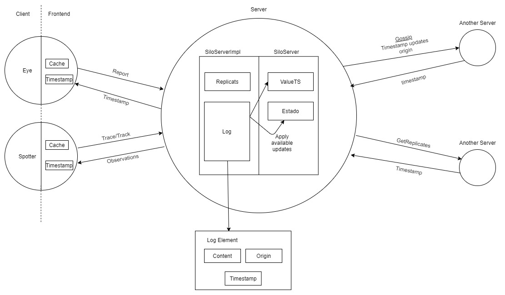

# Relatório do projeto Sauron

Sistemas Distribuídos 2019-2020, segundo semestre

## Autores

**Grupo A18**

| Number | Name              | User                                 | Email                                   |
| -------|-------------------|--------------------------------------|-----------------------------------------|
| 86591  | Lourenço Teodoro  | <https://github.com/ISTTeo>          | <lourenco.teodoro@tecnico.ulisboa.pt>   |
| 89448  | Gonçalo Almeida   | <https://github.com/xaleza>          | <goncalo.h.almeida@tecnico.ulisboa.pt>  |
| 89545  | Tiago Antunes     | <https://github.com/TiagoMAntunes>   | <tiago.melo.antunes@tecnico.ulisboa.pt> |

  

## Melhorias da primeira parte

- [Melhoria dos testes de integração do TrackMatch](https://github.com/tecnico-distsys/A18-Sauron/commit/fb83182441b60b4742b162c0b7b2be4061310feb)
- [Melhoria dos testes de integração do CamJoin](https://github.com/tecnico-distsys/A18-Sauron/commit/b2c4cac1a4750ce12ec4d028b83497ee4c916a1d)
- [Adição de comentários](https://github.com/tecnico-distsys/A18-Sauron/commit/19dc37d5227098c1bdfa5755e23c09fd86e008d8)

## Modelo de faltas

_(que faltas são toleradas, que faltas não são toleradas)_

Seguindo o modelo de faltas descrito no enunciado, o nosso sistema tolera então faltas silenciosas e transientes. Uma vez que os gestores de réplica não podem falhar arbitrariamente, não existem falhas bizantinas, pelo que não são consideradas na nossa implementação. Ainda dentro de faltas transientes, o sistema é então tolerante a comportamento assíncrono, além da implementação com HTTP/2, através da interrupção da tentativa de envio de mensagem após X segundos para voltar a reenviar. Desta forma, volta a enviar o pedido e consegue garantir que se reconecta a outra réplica caso uma delas esteja a demorar muito a responder ou tenha perdido a sua ligação (Sistema de faltas dado afirma ter uma réplica ativa a atender os cliente). A tentativa de reenvio de informação é realizada pelo HTTP/2, mas caso este diga que não está disponível, o cliente tenta ainda enviar de novo um número arbitrário de vezes (assumiu-se 5 como um valor razoável).

No caso de ocorrer omissão de mensagens por parte do canal de comunicação, este problema é resolvido através do uso do _Vector Clock_ por parte do sistema, o que evita este caso de omissão de mensagens. As faltas são tratadas no momento, não havendo faltas densas. Como o modelo de faltas não aceita faltas bizantinas, assume que não há corrupção dos dados por parte do canal de transmissão (o uso de HTTP/2 também evita grande parte dos erros deste caso).

Uma falta não tratada neste caso é: em caso de todas as tentativas do cliente não ocorrer uma resposta mas, numa delas, o servidor ter enviado resposta que se tenha perdido pelo caminho, ocorrerá uma falha de coêrencia. Neste caso, visto que o Vector Clock dos pedidos vai ser diferente, a falta não é tolerada, pois não há forma de distinguir as observações das câmaras por poderem ter sido feitas sequencialmente. O modelo não é portanto tolerante a este caso.

O cliente SiloFrontend é ainda inteligente e tem um sistema de cache para evitar leituras incoerentes por parte do cliente, até ao tamanho da cache. Esta funciona através da relação <Pedido, Resposta>, sendo que alguma lógica poderá não estar totalmente correta, apenas se tem a garantia de que pedidos iguais irão dar a mesma resposta caso os dados estejam desatualizados, dentro de tempo útil. Esta ideia veio motivada do facto de os clientes de leituras são humanos, logo a quantidade de pedidos que vão efetuar irá ser reduzida relativamente à velocidade de propagação dos dados. O modelo de faltas inclui ainda que estas são não definitivas, logo eventualmente o servidor irá reconectar-se, o que passará a ter leituras coerentes eventualmente. O tamanho da cache do cliente spotter pode ainda ser especificada à mão, podendo-se adaptar ao dispositivo onde for utilizado. 

O SiloFrontend é ainda inteligente relativamente ao comando spotter. Caso tenha ocorrido uma falha de ligação à réplica e houver reconexão mas a informação da câmara não tenha sido registada, este regista a câmara e volta a enviar o pedido, tornando o comportamento transparente para o cliente.

## Solução

**TODO Fazer pic mais completa?**
_(Figura da solução de tolerância a faltas)_

_(Breve explicação da solução, suportada pela figura anterior)

A ideia base da solução é termos réplicas que comunicam entre si para garantir a disponibilidade do sistema. Cada réplica comunica as alterações que recebeu dos clientes às outras réplicas.Não havendo necessidade de coerência forte.
Os clientes comunicam através de um frontend que acaba por tornar transparente o funcionamento da comunicação para quem desenvolve a lógica da aplicação.

Explicamos a baixo com mais detalhe o protocolo utilizado.

## Protocolo de replicação

_(Explicação do protocolo)_
O protocolo utilizado é um protocolo de coêrencia fraca com um suplemento de coerência no *frontend* do client.

A ideia do protocolo é simples e baseia-se no conceito de TimeStamps (referenciados no código como VectorClocks) estes objectos permitem uma noção de temporal entre acontecimentos sem recorrer a relógios (que não são fiáveis para sistemas distribuidos).

Recorrendo a estes timestamps podemos ter uma noção da ordem entre actualizações no servidor.

Cada servidor passa agora a manter dois timestamps, um referente às actualizações aplicadas ao estado, *ValueTS* e outro referente às actualizações que estão presentes no seu log *replicaTS*. 

Há ainda um *log*, que é uma estrutura utilizada para manter actualizações recebidas quer dos clientes quer de outras réplicas e é este que é consultado aquando das mensagens de *Gossip* a partir deste que se actualiza o estado do servidor.

Estas mensagens de *Gossip* começam por pedir a cada réplica destino o seu *timestamp* de modo a comparar ao *ReplicaTS* e ver que actualizaçṍes necessita o destino. Com base nisso ocorre um filtro do *log* e enviam-se apenas as actualizações necessárias.

Ao receber actualizações pelo *Gossip* estas são adicionadas ao *log* caso não sejam duplicas de actualizações já existentes no *log*, o *ReplicaTS* é actualizado e, por fim, actualiza-se o estado se tal for possível.

Uma actualização poderá ser aplicada ao estado do servidor quando todas as actualizações que a precedem já foram aplicadas, ou seja, quando o timestamp referente ao estado do servidor indica que não existem *gaps* lógicos entre a actualização e o estado actual do servidor (*ValueTS* >= *timestamp do pedido*).

Para este efeito procedemos a alterações nas mensagens já existentes (maioritariamente a passagem de timestamps nas mensagens de ControlInit e Report) e à criação de duas novas:

**GetReplicaTimestamp** - Permite pedir a uma replica o seu timestamp para conseguirmos decidir que actualizações necessita;

**Gossip** - Mensagem fulcral para o processo de disseminação de actualizações enviando as actualizações necessárias para outras réplicas e permitindo a actualização dos seus estados.

Criamos ainda estruturas auxiliares, em particular para o envio de elementos do Log de cada réplica.

O suplemento para aumento da coerência mencionado resume-se à introdução de uma cache no frontend dos clientes. 
No caso em que um cliente faz uma leitura a um servidor e que depois, por alguma razão, faça a mesma leitura a um outro servidor não actualizado não receberá a leitura desatualizada mas aquela que recebeu inicialmente, para isto é necessário que o *Frontend* compare o seu *timestamp* ao da réplica e caso seja inferior vá buscar o valor que tinha guardado na cache. 

## Opções de implementação

_(Descrição de opções de implementação, incluindo otimizações e melhorias introduzidas)_

Na criação da cache assumimos como default um tamanho suficiente para não ocorrerem erros de coerência, inicialmente consideramos replicar o estado do servidor no frontend mas após uma conversa com os professores chegamos à conclusão que tal seria algo excessivo para o fim pretendido.

Para garantir que o sistema estaria capaz de aguentar falhas de réplicas decidimos manter o log sem o limpar, de modo que em caso de necessidade este possa ser totalmente reposto em réplicas que tenham perdido todas as informações. Esta decisão tornou imprescindível o envio de logs de forma selectiva, reduzindo os envios ao estritamente necessário.

Quando possível optamos pela simplicidade/facilidade de entendimento, por exemplo durante o gossip decidimos enviar mensagens auxiliares com o único propósito de obter o timestamp da réplica destino para depois se proceder à escolha das actualizações a enviar, ao invés de **TODO tentar lembrar alternativa**.

**TODO explicar escolh**

Consideramos necessário proteger todos os timestamps nas réplicas de acesso concorrentes de modo a evitar problemas em que múltiplas réplicas e clientes tentam comunciar com a réplica em questão. **TODO melhorar o issue que o Tiago encontrou**.

## Notas finais

_(Algo mais a dizer?)_

Tivemos outras ideias, em particular na questão da coerência de frontend consideramos uma cache que utilizava logs **TODO descrever ideia  de ontem**.