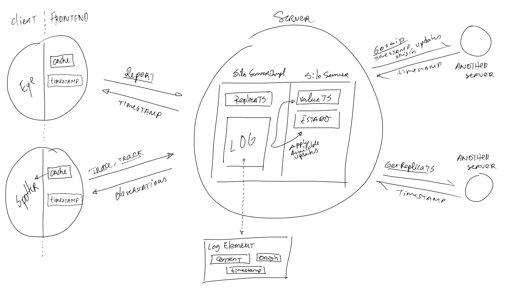

# Relatório do projeto Sauron

Sistemas Distribuídos 2019-2020, segundo semestre

## Autores

**Grupo A18**

| Number | Name              | User                                 | Email                                   |
| -------|-------------------|--------------------------------------|-----------------------------------------|
| 86591  | Lourenço Teodoro  | <https://github.com/ISTTeo>          | <lourenco.teodoro@tecnico.ulisboa.pt>   |
| 89448  | Gonçalo Almeida   | <https://github.com/xaleza>          | <goncalo.h.almeida@tecnico.ulisboa.pt>  |
| 89545  | Tiago Antunes     | <https://github.com/TiagoMAntunes>   | <tiago.melo.antunes@tecnico.ulisboa.pt> |

  

## Melhorias da primeira parte

- [Melhoria dos testes de integração do TrackMatch](https://github.com/tecnico-distsys/A18-Sauron/commit/fb83182441b60b4742b162c0b7b2be4061310feb)
- [Melhoria dos testes de integração do CamJoin](https://github.com/tecnico-distsys/A18-Sauron/commit/b2c4cac1a4750ce12ec4d028b83497ee4c916a1d)
- [Adição de comentários](https://github.com/tecnico-distsys/A18-Sauron/commit/19dc37d5227098c1bdfa5755e23c09fd86e008d8)

## Modelo de faltas

_(que faltas são toleradas, que faltas não são toleradas)_
São toleradas faltas silenciosas e transientes. Uma vez que os gestores de réplica não podem falhar arbitrariamente, não existem falhas bizantinas, pelo que não são consideradas na nossa implementação.

## Solução

**TODO make pic better?**
_(Figura da solução de tolerância a faltas)_

_(Breve explicação da solução, suportada pela figura anterior)_
Explicamos a baixo com mais detalhe o protocolo utilizado.

## Protocolo de replicação

_(Explicação do protocolo)_
O protocolo utilizado é um protocolo de coêrencia fraca com um suplemento de coerência no frontend do client.

A ideia do protocolo é simples e baseia-se no conceito de TimeStamps (referenciados no código como VectorClocks) estes objectos permitem uma noção de temporal entre acontecimentos sem recorrer a relógios (que não são fiáveis para sistemas distribuidos).

Recorrendo a estes timestamps podemos ter uma noção da ordem entre actualizações no servidor.

Cada servidor passa agora a manter dois timestamps, um referente às actualizações aplicadas ao estado, *ValueTS* e outro referente às actualizações que estão presentes no seu log *replicaTS*. Há ainda um log, que é uma estrutura utilizada para manter actualizações recebidas quer dos clientes quer de outras réplicas e é este que é consultado aquando das mensagens de Gossipe a partir deste que se actualiza o estado do servidor.

Uma actualização poderá ser aplicada ao estado do servidor quando todas as actualizações que a precedem já foram aplicadas, ou seja, quando o timestamp referente ao estado do servidor indica que não existem *gaps* lógicos entre a actualização e o estado actual do servidor.

Para este efeito procedemos a alterações nas mensagens já existentes (maioritariamente a passagem de timestamps nas mensagens de ControlInit e Report) e à criação de duas novas:

**GetReplicaTimestamp** - Permite pedir a uma replica o seu timestamp para conseguirmos decidir que actualizações necessita;

**Gossip** - Mensagem fulcral para o processo de disseminação de actualizações enviando as actualizações necessárias para outras réplicas e permitindo a actualização dos seus estados.

Criamos ainda estruturas auxiliares, em particular para o envio de elementos do Log de cada réplica.

O suplemento para aumento da coerência mencionado resume-se à introdução de uma cache no frontend dos clientes. 
Esta cache garante que caso um cliente tenha feito uma leitura a um servidor e que depois, por alguma razão, faça a mesma leitura a um outro servidor não actualizado não receberá a leitura desatualizada mas aquela que recebeu inicialmente. 

**TODO preciso justificar o facto de nao estarmos a guardar os objectos em si mas so os pedidos? Aquela coisa de replicar o servidor inteiro ser mau e coisa e tal**

## Opções de implementação

_(Descrição de opções de implementação, incluindo otimizações e melhorias introduzidas)_

Na criação da cache assumimos como default um tamanho suficiente para não ocorrerem erros de coerência, inicialmente consideramos replicar o estado do servidor no frontend mas após uma conversa com os professores chegamos à conclusão que tal seria algo excessivo para o fim pretendido.

Para garantir que o sistema estaria capaz de aguentar falhas de réplicas decidimos manter o log sem o limpar, de modo que em caso de necessidade este possa ser totalmente reposto em réplicas que tenham perdido todas as informações. Esta decisão tornou imprescindível o envio de logs de forma selectiva, reduzindo os envios ao estritamente necessário.

Quando possível optamos pela simplicidade/facilidade de entendimento, por exemplo durante o gossip decidimos enviar mensagens auxiliares com o único propósito de obter o timestamp da réplica destino para depois se proceder à escolha das actualizações a enviar, ao invés de **TODO tentar lembrar alternativa**.

**TODO explicar escolher estruturas com base nos tempos**

**TODO descrever sitema que consideramos implementar?**

## Notas finais

_(Algo mais a dizer?)_
